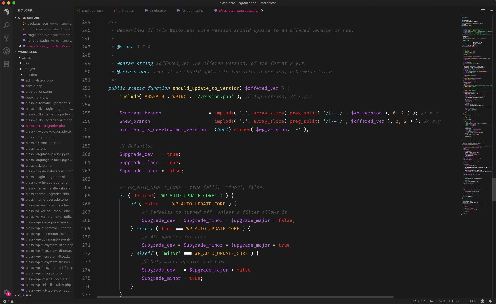

:wave: Hey, this is my first theme. I created it because I want a theme that has a dark grey background with bright font colors. I found so many great themes that were close but not there exactly so I decide to make my own. If you find it useful, great! 

It's still a work in progress and if you have any suggestions or see any issues please let me know.

## Screenshots

> *JavaScript*

> *JSON*

> *PHP class*

> *PHP mixed with HTML, a typical WordPress theme template*

> *CSS SCSS*

## Installation and use
1. Open the **Extensions** sidebar in VS Code
2. Search for `Hotline`
3. Click **Install**
4. Activate the theme with <kbd>⌘</kbd>+<kbd>K</kbd>, <kbd>⌘</kbd>+<kbd>T</kbd> or <kbd>Ctrl</kbd>+<kbd>K</kbd>, <kbd>Ctrl</kbd>+<kbd>T</kbd> and select `Hotline`